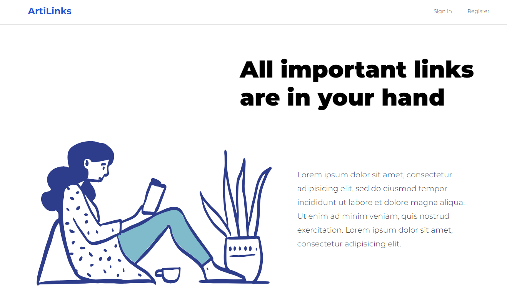
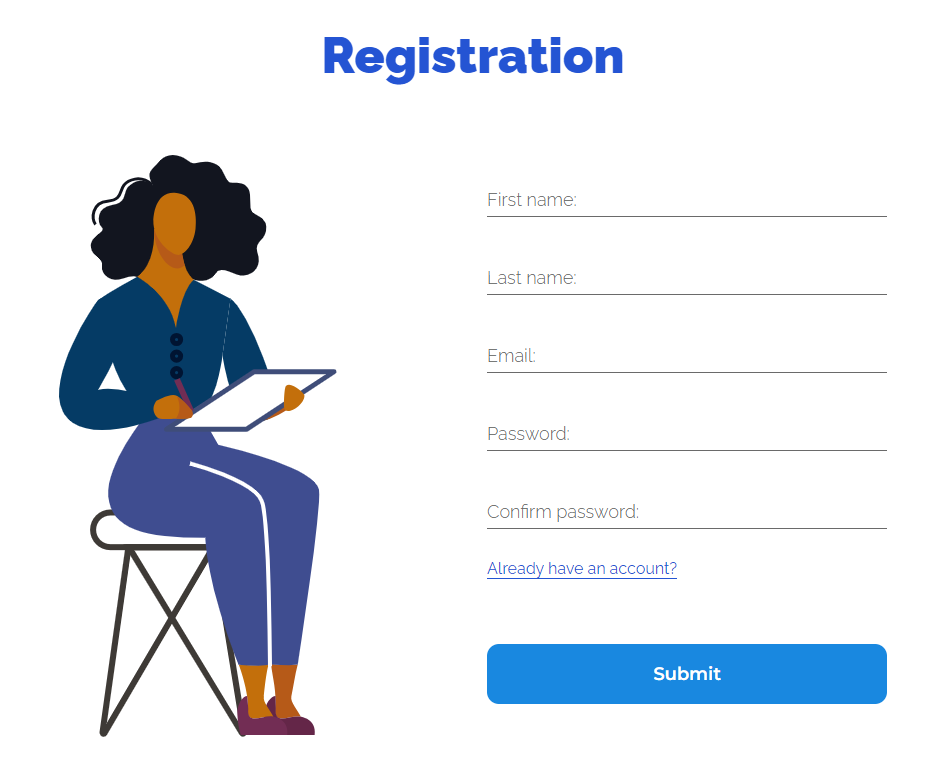
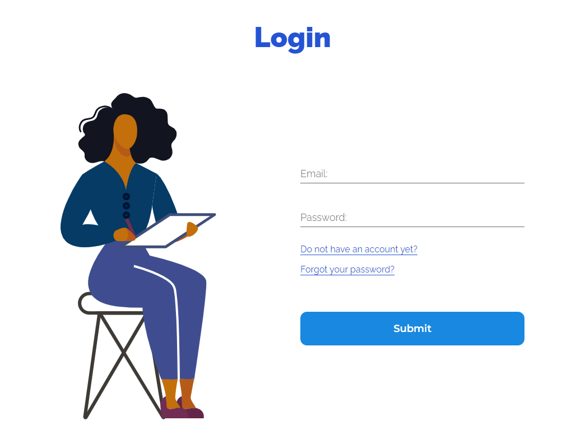
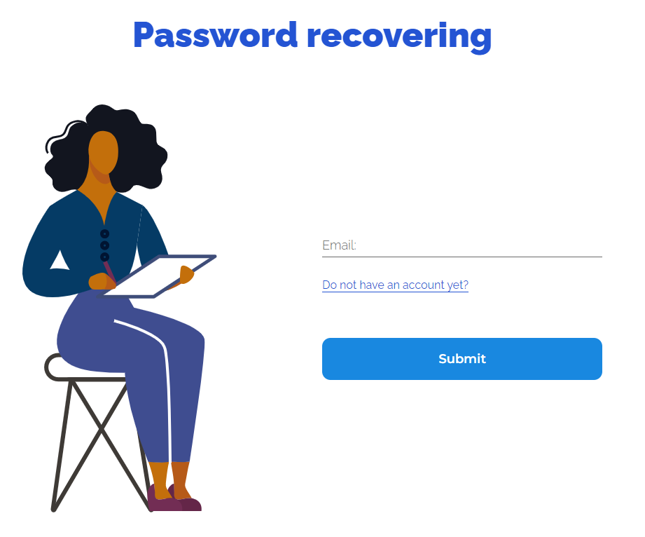
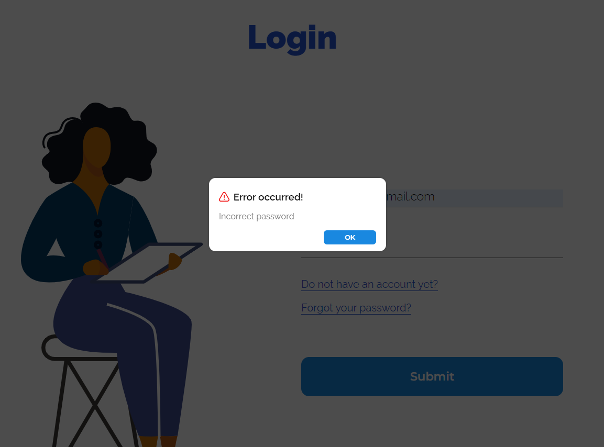
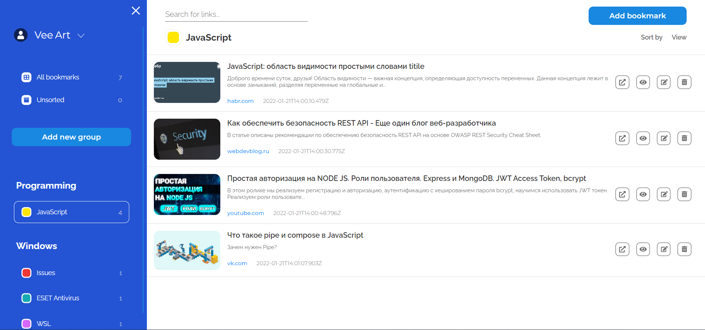
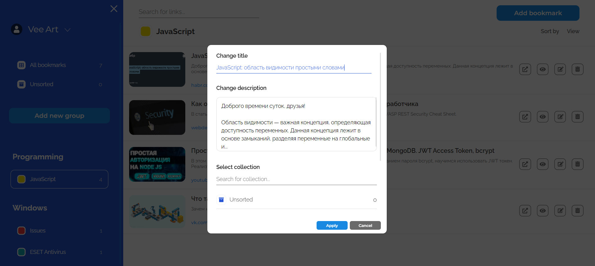
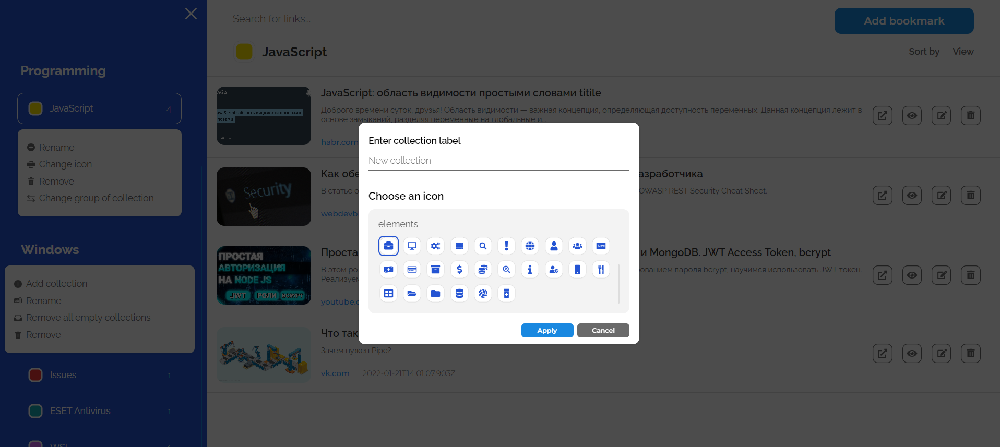
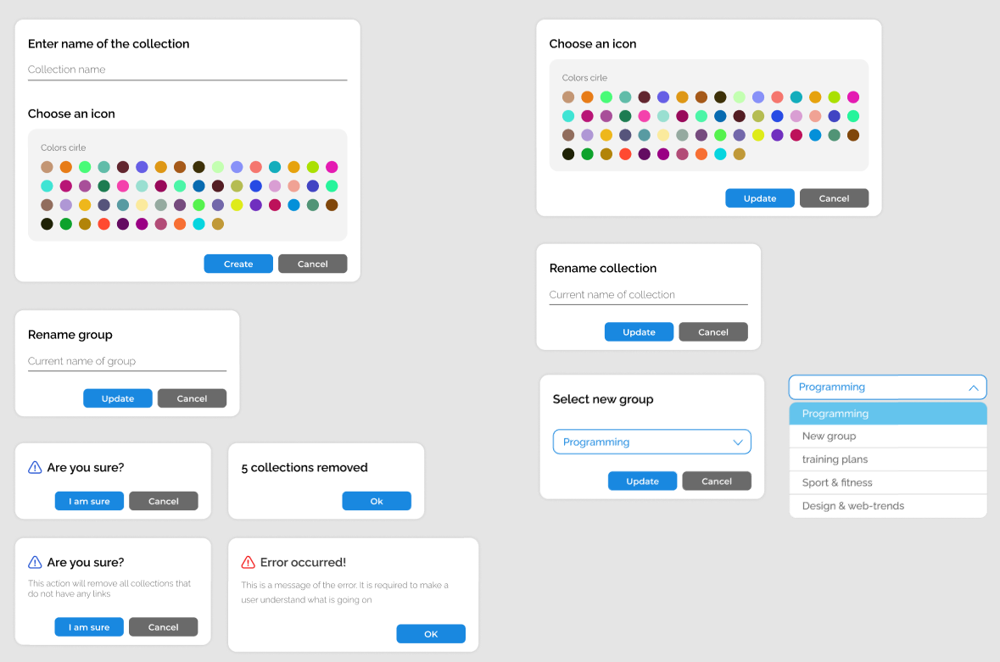

# **ArtiLinks** - Bookmark Manager

Read this in other languages: [Русский](./README.ru.md), [English](./README.md).

## Project idea:

---

The application solves the problem of storing & categorizing links to useful online-services.

**Deployment** [here](https://artilinks.vercel.app/).

## Implemented functionality:

---

1. Registration with email confirmation & Authorization
1. Password recovery via email
1. Categorization of links (groups & collections):
    - **Group** is a container that stores a set of collections
    - **Collection** is a container that stores the links
    - Example: _Programming_ is a group, _Javascript_ is a collection
1. Full-fledged **CRUD** API for the groups & collections
1. Ability to change a group of a created collection
1. Automatic data scraping of resources:
    - Retrieving favicons, titles, descriptions, and domain names
1. Links searching functionality within the considered collection:
    - Search is made by the link title & the resource domain
1. Error notifications

## Used technologies:

---

| Technology             | Description |
|------------------------|----------|
| NextJS                 | React server-side rendering framework |
| jsonwebtoken           | User Registration & Authentication |
| nodemailer             | Email confirmation & Password recovery |
| MongoDB/Mongoose       | Cloud-based database |
| axios                  | API requests of client & server sides |
| open-graph-scraper     | Data scraping of resources |
| react-transition-group | Animations of rendered components |

## Difficulties encountered & Interesting task:

---

The most time consuming and interesting part was developing the JWT authentication/registration. This approach was new to me, so I had to spend a lot of time searching for information about how to write such functionality correctly. In the end, I implemented a separate service class to handle **refresh/access-tokens**. The main problem was access-token update in the case when user sent a request to the API-protected route, being authenticated, but having an already expired access-token. I found out that the **axios** library supports **interceptor functionality**, which have solved my problem. With an expired access-token, my server returns a **401 authorization error**, in the interceptor response from the server I catch this type of error, send a request to update the tokens, and then try to repeat the original request.

## Screenshots and videos:

---

### **Youtube** video with functionality demonstration:

    

### Main page screen:

    

    

### Registration & Login:

    
    

### Password Recovering:

    

### Error Notifications:

    

### Dashboard View:

    

    

### Bookmark Editing:

    

### Collection Creation:

    

### Available Dialogs:

    

