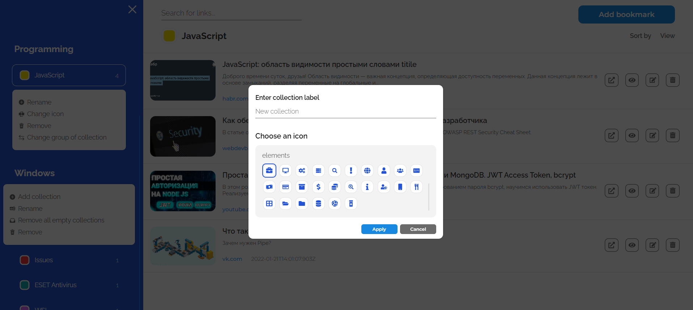

# **ArtiLinks** - Bookmark Manager

Читать это на других языках: [English](./README.md), [Русский](./README.ru.md).

## Идея проекта:

---

Приложение решает проблему хранения и категоризации ссылок на полезные онлайн-сервисы.

**Deployment** [здесь](https://artilinks.vercel.app/).

## Реализованная функциональность:

---

1. Регистрация с подтверждением по электронной почте и авторизация
1. Восстановление пароля по электронной почте
1. Категоризация ссылок (группы и коллекции):
    - **Группа** - это контейнер, в котором хранится набор коллекций
    - **Коллекция** - это контейнер, в котором хранятся ссылки
    - Например: _Programming_ - это группа, _Javascript_ - это коллекция
1. Полноценный **CRUD** API для групп и коллекций
1. Возможность изменить группу созданной коллекции
1. Автоматическое получение данных с ресурсов:
    - Извлечение фавиконов, заголовков, описаний и доменных имен
1. Функциональность поиска ссылок в рассматриваемой коллекции:
    - Поиск осуществляется по названию ссылки и домену ресурса
1. Уведомления об ошибках

## Использованные технологии:

---

| Технология             | Описание |
|------------------------|----------|
| NextJS                 | React-фреймворк для рендеринга на стороне сервера |
| jsonwebtoken           | Регистрация и аутентификация пользователей |
| nodemailer             | Подтверждение электронной почты и восстановление пароля |
| MongoDB/Mongoose       | Облачная база данных |
| axios                  | API-запросы клиентской и серверной сторон |
| open-graph-scraper     | Получение данных о ресурсах |
| react-transition-group | Анимация отрисованных компонентов |

## Увлекательная задача в проекте и возникшие сложности:

---

Наиболее трудоемкая и интересная часть была разработка **JWT аутентификации/регистрации**. Данный подход был для меня новым, поэтому мне пришлось уделить много времени на поиск информации о том, как нужно правильно писать такой функционал. В итоге я реализовал отдельный класс-сервис по работе с **refresh/access-токенами**. Основной проблемой было **обновление access-токена** в случае, когда пользователь отправил запрос на защищенный API путь, будучи аутентифицированным, но имея уже **инвалидированный access-токен**. Я узнал, что библиотека axios поддерживает **функционал интерсепторов**, которые как раз могли решить мою проблему. При инвалидированном access-токене мой сервер возвращает ошибку авторизации 401, в интерсепторе ответа с сервера я отлавливаю данный тип ошибки, отправляю запрос на обновление токенов, а после пытаюсь повторить исходный запрос.

## Скриншоты и видео:

---

### **Youtube** видео с демонстрацией функциональности:

    

### Экран главной страницы:

    

    

### Регистрация и Логин:

    
    

### Восстановление пароля:

    

### Уведомления об ошибках:

    

### Вид главной панели:

    

    

### Редактирование закладок:

    

### Создание коллекции:

    

### Доступные диалоговые окна:

    

